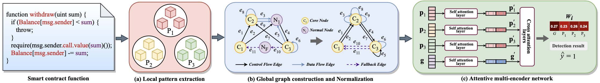
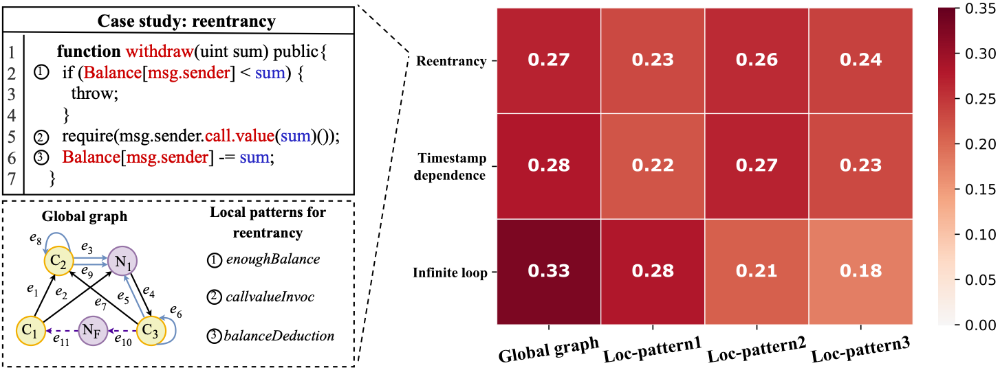

# AMEVulDetector
This repo is a python implementation of Smart Contract Vulnerability Detection: From Pure Neural Network to Interpretable Graph Feature and Expert Pattern Fusion. 


## Overview
<div align=center></div>
The overall architecture of our proposed method is illustrated in the Figure, which consists of three components: 
(a) a local expert pattern extraction tool, which extracts vulnerability-specific expert patterns from the code; 
(b) a graph construction and normalization module, which transforms the source code into a global semantic graph; 
and (c) an attentive multi-encoder network that combines expert patterns and the graph feature for vulnerability detection and outputs explainable weights.


## Citation
Please use this citation in your paper if you refer to our [paper](https://www.ijcai.org/Proceedings/2020/0454.pdf) or code.
```
@inproceedings{liu2021smart,
  title={Smart Contract Vulnerability Detection: From Pure Neural Network to Interpretable Graph Feature and Expert Pattern Fusion},
  author={Liu, Zhenguang and Qian, Peng and Wang, Xiang and Zhu, Lei and He, Qinming and Ji, Shouling},
   booktitle={IJCAI},
  pages={2751--2759},
  year={2021}
}
``` 


## Required Packages
* **python** 3 or above
* **TensorFlow** 2.0 or above
* **sklearn** 0.20.2
* **numpy** 1.18 or above
* ****


Run the following script to install the required packages.
```shell
pip install --upgrade pip
pip install tensorflow==2.0
pip install scikit-learn==0.20.2
pip install numpy==1.18
```


## Dataset
We empirically evaluate our proposed method on two benchmark datasets, namely Ethereum smart contract (ESC) and VNT Chain smart contract (VSC). 
Following [Zhuang et al., 2020](https://www.ijcai.org/Proceedings/2020/0454.pdf), we conduct experiments for reentrancy and timestamp dependence vulnerability on ESC, and evaluate infinite loop vulnerability on VSC.

The specific description of the two datasets can be found in Zhuang et al., 2020, while the source code are released on [Github](https://github.com/Messi-Q/GNNSCVulDetector).

More details for the dataset instruction can be found on our dataset page at [Smart-Contract-Dataset](https://github.com/Messi-Q/Smart-Contract-Dataset), which is continuously improving.

## Getting started
* To run program, please use this command: python3 AMEVulDetector.py.
* Also, you can set specific hyper-parameters. and all the hyper-parameters can be found in `parser.py`.

Examples:
```shell
python3 AMEVulDetector.py
python3 AMEVulDetector.py --model EncoderWeight --lr 0.002 --dropout 0.2 --epochs 100 --batch_size 32
```


## Case Study 
We further present a case study in the following Figure, where the withdraw function is a real-world smart contract function that is vulnerable to reentrancy vulnerability. Particularly, we characterize the function code as both the global graph and three local patterns for reentrancy (respectively corresponding to the enoughBalance, callValueInvoc, balanceDeduction), which are shown in the left of the following figure. Intuitively, The weights of the global graph feature and each local pattern feature are illustrated in the right of the following figure, where our system is able to clearly explain the reasons behind our prediction.

<div align=center></div>

### Note
If any question, please email to messi.qp711@gmail.com. 


### Reference
1. Zhuang, Yuan and Liu, Zhenguang and Qian, Peng, et al. Smart Contract Vulnerability Detection using Graph Neural Network. IJCAI, 2020. [GNNSCVulDetector](https://github.com/Messi-Q/GNNSCVulDetector)
2. Qian P, Liu Z, He Q, et al. Towards automated reentrancy detection for smart contracts based on sequential models. 2020. [ReChecker](https://github.com/Messi-Q/ReChecker)


