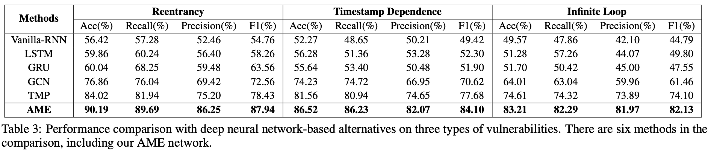
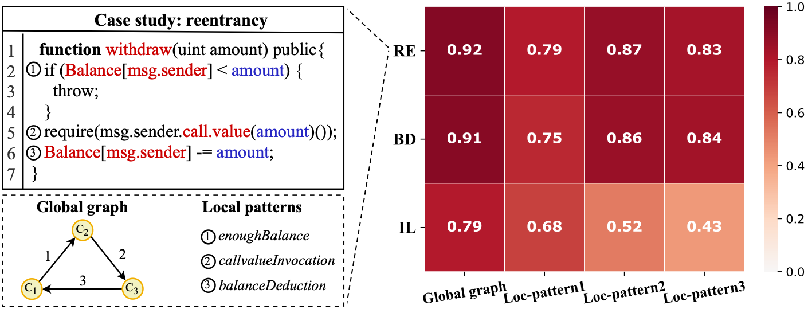

# Explanation-Vulnerability-Detector

This repo is a python implementation of smart contract vulnerability detection of our method, 
combining the global graph feature and local expert patterns. 
Here, we explore using graph neural networks and expert knowledge for smart contract vulnerability detection.


## Required Packages
* **python**3 or above
* **TensorFlow** 2.0 or above
* **sklearn** for model evaluation


Run the following script to install the required packages.
```shell
pip install --upgrade pip
pip install tensorflow==2.0
pip install scikit-learn
```


## Dataset
We empirically evaluate our proposed methods on two open-source datasets released in the [paper](https://www.ijcai.org/Proceedings/2020/0454.pdf), 
namely Ethereum smart contract (ESC) and VNT Chain smart contract (VSC).
Experiments for reentrancy and blockInfo dependence vulnerability are conducted on ESC, 
while infinite loop vulnerability is evaluated on VSC.

## Global graph feature and local pattern feature

The contract graph features are extracted by using a temporal-message-propagation graph neural network in the [paper](https://www.ijcai.org/Proceedings/2020/0454.pdf), 
while the local expert pattern features are extracted by using a feed-forward network.  


## Running Project
* To run program, use this command: python AMEVulDetector.py.
* Also, you can use specific hyper-parameters to train the model. All the hyper-parameters can be found in `parser.py`.

Examples:
```shell
python AMEVulDetector.py
python AMEVulDetector.py --model EncoderWeight --lr 0.002 --dropout 0.2 --epochs 50 --batch_size 32
```


## Performance comparison

<div align=center></div>
<div align=center></div>


## Case Study 
We now present a case study of interpretability evaluation on a real-world function that is vulnerable to reentrancy 
vulnerability. Particularly, we characterize a function code of reentrancy vulnerability as both the global graph and 
local expert patterns, which are shown in the left of this figure. Intuitively, the interpretable weights of the 
global graph feature and local pattern features are illustrated in the right of Fig. 8, where the features with the 
high weight may play an important role in detecting reentrancy vulnerability.


<div align=center></div>


## Interpretability Evaluation

<div></div>
<div></div>
<div></div>

