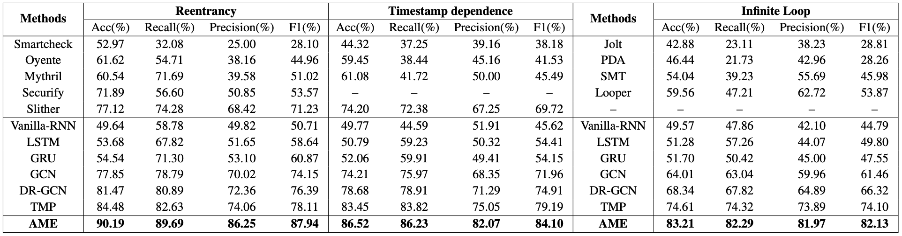

# AMEVulDetector
This repo is a python implementation of our AMEVulDetector for smart contract vulnerability detection, which combines the global graph feature and local expert patterns. 


## Overview
<div align=center></div>
The overall architecture of our proposed method is illustrated in this figure, which consists of three components: (a) a local expert pattern extraction tool, which extracts vulnerability-specific expert patterns from the code; (b) a graph construction and normalization module, which transforms the source code into a global semantic graph; and (c) an attentive multi-encoder network that combines expert patterns and the graph feature for vulnerability detection and outputs explainable weights.


## Required Packages
* **python**3 or above
* **TensorFlow** 2.0 or above
* **sklearn** for model evaluation
* **numpy** 1.18 or above
* ****


Run the following script to install the required packages.
```shell
pip install --upgrade pip
pip install tensorflow==2.0
pip install scikit-learn
pip install numpy
```


## Dataset
We empirically evaluate our proposed method on two benchmark datasets, namely Ethereum smart contract (ESC) and VNT Chain smart contract (VSC). Following Zhuang et al., 2020, we conduct experiments for reentrancy and timestamp dependence vulnerability on ESC, and evaluate infinite loop vulnerability on VSC.

The specific description of the two datasets can be found in Zhuang et al., 2020, while the datasets and source code on Github.


## Getting started
* To run program, use this command: python AMEVulDetector.py.
* Also, you can use specific hyper-parameters to train the model. All the hyper-parameters can be found in `parser.py`.

Examples:
```shell
python AMEVulDetector.py
python AMEVulDetector.py --model EncoderWeight --lr 0.002 --dropout 0.2 --epochs 50 --batch_size 32
```


## Results
<div align=center></div>


## Case Study 
We further present a case study in the following Figure, where the withdraw function is a real-world smart contract function that is vulnerable to reentrancy vulnerability. Particularly, we characterize the function code as both the global graph and three local patterns for reentrancy (respectively corresponding to the enoughBalance, callValueInvoc, balanceDeduction), which are shown in the left of the following figure. Intuitively, The weights of the global graph feature and each local pattern feature are illustrated in the right of the following figure, where our system is able to clearly explain the reasons behind our prediction.

<div align=center></div>


<!-- ### Evaluations of Interpretability on three types of vulnerabilities -->

